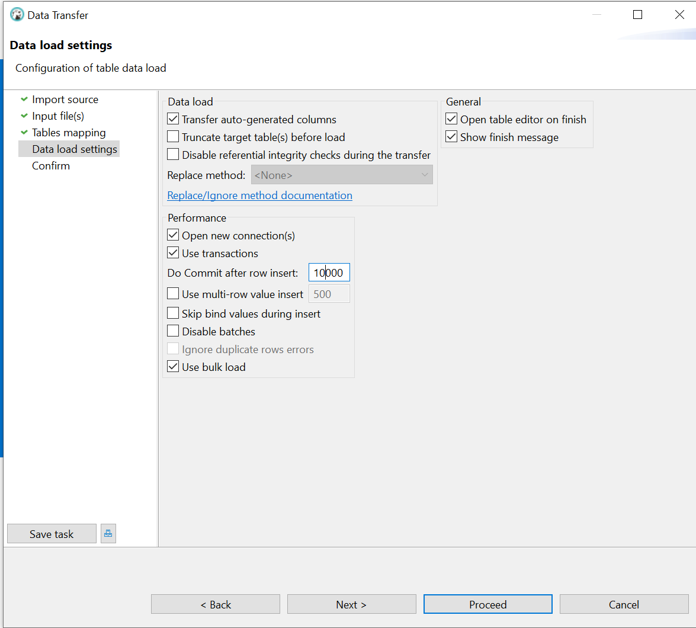

1. Взять выгрузку из чикагского такси на 10 Гб и попытаться ускорить аналитический ответ
любыми способами.
Cloud Console URL - https://console.cloud.google.com/storage/browser/chicago10
gsutil URI - gs://chicago10

Загрузка осуществляла через DBeaver - Data Transfer





DDL сформированный DBeaver

```
CREATE TABLE public.taxi_csv (
	unique_key varchar(50) NULL,
	taxi_id varchar(128) NULL,
	trip_start_timestamp varchar(50) NULL,
	trip_end_timestamp varchar(50) NULL,
	trip_seconds real NULL,
	trip_miles real NULL,
	pickup_census_tract varchar(50) NULL,
	dropoff_census_tract varchar(50) NULL,
	pickup_community_area varchar(50) NULL,
	dropoff_community_area varchar(50) NULL,
	fare real NULL,
	tips real NULL,
	tolls varchar(50) NULL,
	extras real NULL,
	trip_total real NULL,
	payment_type varchar(50) NULL,
	company varchar(50) NULL,
	pickup_latitude varchar(50) NULL,
	pickup_longitude varchar(50) NULL,
	pickup_location varchar(50) NULL,
	dropoff_latitude varchar(50) NULL,
	dropoff_longitude varchar(50) NULL,
	dropoff_location varchar(50) NULL
);
```

Но на большом количестве файлов dbeaver у меня вылетал, поэтому часть данных загрузила через Dbeaver, часть через copy

```
chicago=# DO
$do$
        DECLARE fn TEXT;
BEGIN
    FOR i IN 16..39
    LOOP
        RAISE NOTICE 'path %', '/chicago10/taxi.csv.0000000000' || i;
                fn = '/chicago10/taxi.csv.0000000000' || i;
                EXECUTE 'COPY taxi_csv FROM ''' || fn || ''' WITH delimiter '','' CSV HEADER';               
    END LOOP;
END          
$do$
LANGUAGE plpgsql;
NOTICE:  path /chicago10/taxi.csv.000000000016
NOTICE:  path /chicago10/taxi.csv.000000000017
NOTICE:  path /chicago10/taxi.csv.000000000018
NOTICE:  path /chicago10/taxi.csv.000000000019
NOTICE:  path /chicago10/taxi.csv.000000000020
NOTICE:  path /chicago10/taxi.csv.000000000021
NOTICE:  path /chicago10/taxi.csv.000000000022
NOTICE:  path /chicago10/taxi.csv.000000000023
NOTICE:  path /chicago10/taxi.csv.000000000024
NOTICE:  path /chicago10/taxi.csv.000000000025
NOTICE:  path /chicago10/taxi.csv.000000000026
NOTICE:  path /chicago10/taxi.csv.000000000027
NOTICE:  path /chicago10/taxi.csv.000000000028
NOTICE:  path /chicago10/taxi.csv.000000000029
NOTICE:  path /chicago10/taxi.csv.000000000030
NOTICE:  path /chicago10/taxi.csv.000000000031
NOTICE:  path /chicago10/taxi.csv.000000000032
NOTICE:  path /chicago10/taxi.csv.000000000033
NOTICE:  path /chicago10/taxi.csv.000000000034
NOTICE:  path /chicago10/taxi.csv.000000000035
NOTICE:  path /chicago10/taxi.csv.000000000036
NOTICE:  path /chicago10/taxi.csv.000000000037
NOTICE:  path /chicago10/taxi.csv.000000000038
NOTICE:  path /chicago10/taxi.csv.000000000039
DO
```

2. \timing
3. Исходный запрос
```
chicago=# SELECT payment_type, round(sum(tips)/sum(tips+fare)*100) tips_persent, count(*)
FROM taxi_csv
group by payment_type
order by 3 desc;
 payment_type | tips_persent |  count   
--------------+--------------+----------
 Cash         |            0 | 17231871
 Credit Card  |           18 |  9224956
 Unknown      |            0 |   103869
 Prcard       |            1 |    86053
 Mobile       |           17 |    61256
 No Charge    |            0 |    26294
 Pcard        |            2 |    13575
 Dispute      |            0 |     5596
 Split        |           19 |      180
 Way2ride     |           14 |       27
 Prepaid      |            0 |        6
(11 rows)

Time: 771345.322 ms (12:51.345)
```

1 способ - попробовала поменять параметры в конфиге - не получилось ускорить

Изначально max_parallel_workers_per_gather = 2

```
                                                                           QUERY PLAN                                                                            
-----------------------------------------------------------------------------------------------------------------------------------------------------------------
 Sort  (cost=1624612.15..1624612.16 rows=4 width=23) (actual time=561208.441..561368.908 rows=11 loops=1)
   Sort Key: (count(*)) DESC
   Sort Method: quicksort  Memory: 25kB
   ->  Finalize GroupAggregate  (cost=1624611.03..1624612.11 rows=4 width=23) (actual time=561208.372..561368.859 rows=11 loops=1)
         Group Key: payment_type
         ->  Gather Merge  (cost=1624611.03..1624611.96 rows=8 width=23) (actual time=561208.317..561368.797 rows=33 loops=1)
               Workers Planned: 2
               Workers Launched: 2
               ->  Sort  (cost=1623611.01..1623611.02 rows=4 width=23) (actual time=561172.885..561172.890 rows=11 loops=3)
                     Sort Key: payment_type
                     Sort Method: quicksort  Memory: 25kB
                     Worker 0:  Sort Method: quicksort  Memory: 25kB
                     Worker 1:  Sort Method: quicksort  Memory: 25kB
                     ->  Partial HashAggregate  (cost=1623610.93..1623610.97 rows=4 width=23) (actual time=561172.795..561172.804 rows=11 loops=3)
                           Group Key: payment_type
                           Batches: 1  Memory Usage: 24kB
                           Worker 0:  Batches: 1  Memory Usage: 24kB
                           Worker 1:  Batches: 1  Memory Usage: 24kB
                           ->  Parallel Seq Scan on taxi_csv  (cost=0.00..1544607.07 rows=6320308 width=15) (actual time=0.028..554850.911 rows=8917894 loops=3)
 Planning Time: 10.796 ms
 JIT:
   Functions: 21
   Options: Inlining true, Optimization true, Expressions true, Deforming true
   Timing: Generation 4.813 ms (Deform 1.883 ms), Inlining 486.344 ms, Optimization 607.516 ms, Emission 475.353 ms, Total 1574.026 ms
 Execution Time: 561504.198 ms
(25 rows)
```

Установила 
```
max_parallel_workers_per_gather = 4
work_mem='32MB'
```

По плану запроса видно, что Workers Launched стал равен 3, но стало медленней
```
                                                                           QUERY PLAN                                                                            
-----------------------------------------------------------------------------------------------------------------------------------------------------------------
 Sort  (cost=1567730.47..1567730.48 rows=4 width=23) (actual time=687885.985..687903.573 rows=11 loops=1)
   Sort Key: (count(*)) DESC
   Sort Method: quicksort  Memory: 25kB
   ->  Finalize GroupAggregate  (cost=1567728.28..1567730.43 rows=4 width=23) (actual time=687882.036..687903.460 rows=11 loops=1)
         Group Key: payment_type
         ->  Gather Merge  (cost=1567728.28..1567730.20 rows=16 width=23) (actual time=687875.466..687896.104 rows=43 loops=1)
               Workers Planned: 4
               Workers Launched: 3
               ->  Sort  (cost=1566728.23..1566728.24 rows=4 width=23) (actual time=687563.184..687567.269 rows=11 loops=4)
                     Sort Key: payment_type
                     Sort Method: quicksort  Memory: 25kB
                     Worker 0:  Sort Method: quicksort  Memory: 25kB
                     Worker 1:  Sort Method: quicksort  Memory: 25kB
                     Worker 2:  Sort Method: quicksort  Memory: 25kB
                     ->  Partial HashAggregate  (cost=1566728.15..1566728.19 rows=4 width=23) (actual time=687552.174..687555.950 rows=11 loops=4)
                           Group Key: payment_type
                           Batches: 1  Memory Usage: 24kB
                           Worker 0:  Batches: 1  Memory Usage: 24kB
                           Worker 1:  Batches: 1  Memory Usage: 24kB
                           Worker 2:  Batches: 1  Memory Usage: 24kB
                           ->  Parallel Seq Scan on taxi_csv  (cost=0.00..1519325.84 rows=3792184 width=15) (actual time=1.604..681878.344 rows=6688421 loops=4)
 Planning Time: 30.207 ms
 JIT:
   Functions: 27
   Options: Inlining true, Optimization true, Expressions true, Deforming true
   Timing: Generation 5.950 ms (Deform 3.198 ms), Inlining 699.954 ms, Optimization 880.431 ms, Emission 585.601 ms, Total 2171.935 ms
 Execution Time: 688088.568 ms
(27 rows)
```

2 способ - колоночное хранение - тут получилось ускорить

Использовала https://github.com/citusdata/citus

```
chicago=# CREATE EXTENSION citus;
CREATE EXTENSION
Time: 8414.148 ms (00:08.414)
chicago=# CREATE TABLE public.taxi_csv_columnar (
        unique_key varchar(50) NULL,
        taxi_id varchar(128) NULL,
        trip_start_timestamp varchar(50) NULL,
        trip_end_timestamp varchar(50) NULL,
        trip_seconds real NULL,
        trip_miles real NULL,
        pickup_census_tract varchar(50) NULL,
        dropoff_census_tract varchar(50) NULL,
        pickup_community_area varchar(50) NULL,
        dropoff_community_area varchar(50) NULL,
        fare real NULL,
        tips real NULL,
        tolls varchar(50) NULL,
        extras real NULL,
        trip_total real NULL,
        payment_type varchar(50) NULL,
        company varchar(50) NULL,
        pickup_latitude varchar(50) NULL,
        pickup_longitude varchar(50) NULL,
        pickup_location varchar(50) NULL,
        dropoff_latitude varchar(50) NULL,
        dropoff_longitude varchar(50) NULL,
        dropoff_location varchar(50) NULL
) USING columnar;
CREATE TABLE
Time: 117.963 ms

chicago=# insert into taxi_csv_columnar select * from taxi_csv;
INSERT 0 26753683
Time: 1336115.677 ms (22:16.116)

chicago=# SELECT payment_type, round(sum(tips)/sum(tips+fare)*100) tips_persent, count(*)
FROM taxi_csv_columnar
group by payment_type
order by 3 desc;
 payment_type | tips_persent |  count   
--------------+--------------+----------
 Cash         |            0 | 17231871
 Credit Card  |           18 |  9224956
 Unknown      |            0 |   103869
 Prcard       |            1 |    86053
 Mobile       |           17 |    61256
 No Charge    |            0 |    26294
 Pcard        |            2 |    13575
 Dispute      |            0 |     5596
 Split        |           19 |      180
 Way2ride     |           14 |       27
 Prepaid      |            0 |        6
(11 rows)

Time: 17594.194 ms (00:17.594)

chicago=# explain analyze SELECT payment_type, round(sum(tips)/sum(tips+fare)*100) tips_persent, count(*)
FROM taxi_csv_columnar
group by payment_type
order by 3 desc;
                                                                           QUERY PLAN                                                                           
----------------------------------------------------------------------------------------------------------------------------------------------------------------
 Sort  (cost=356326.32..356326.82 rows=200 width=134) (actual time=15656.971..15656.999 rows=11 loops=1)
   Sort Key: (count(*)) DESC
   Sort Method: quicksort  Memory: 25kB
   ->  HashAggregate  (cost=356315.18..356318.68 rows=200 width=134) (actual time=15656.952..15656.973 rows=11 loops=1)
         Group Key: payment_type
         Batches: 1  Memory Usage: 40kB
         ->  Custom Scan (ColumnarScan) on taxi_csv_columnar  (cost=0.00..21894.14 rows=26753683 width=126) (actual time=7.266..6667.614 rows=26753683 loops=1)
               Columnar Projected Columns: fare, tips, payment_type
 Planning Time: 1.024 ms
 JIT:
   Functions: 5
   Options: Inlining false, Optimization false, Expressions true, Deforming true
   Timing: Generation 0.643 ms (Deform 0.076 ms), Inlining 0.000 ms, Optimization 0.243 ms, Emission 5.516 ms, Total 6.402 ms
 Execution Time: 15657.792 ms
(14 rows)

Time: 15703.782 ms (00:15.704)
```
