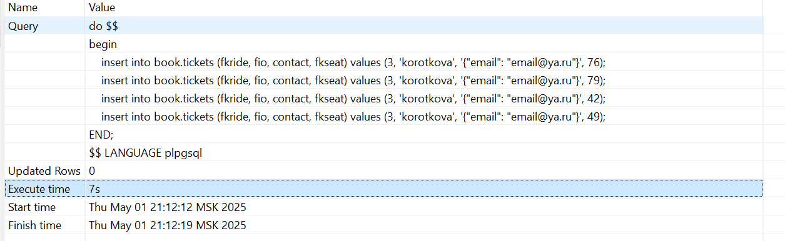
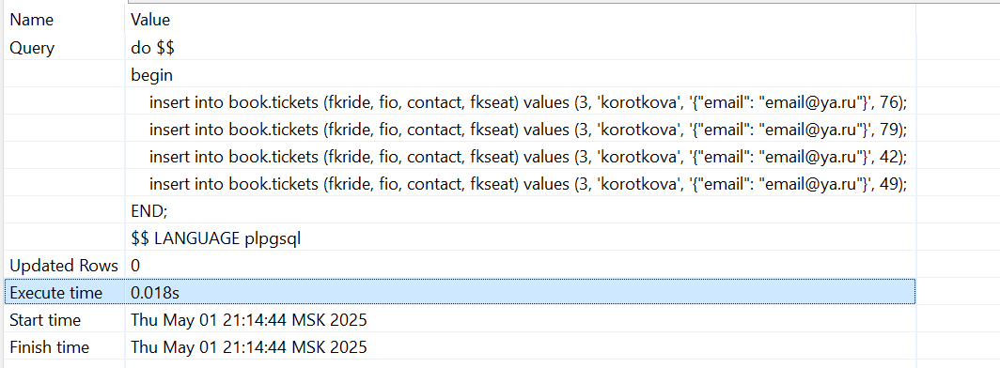

Реализовать итоговую таблицу подсчета Тайских перевозок, написать триггер, чтобы на вставку записи увеличить на поездке количество занятых мест в автобусе.

Оценить падение производительности по сравнению со вставкой без триггера.

Задание со *:

Обработать удаление и проверку на отрицательное количество мест/превышение количества проданных билетов.

1. Создаем материализованное представление

```
CREATE MATERIALIZED VIEW seat_view as
WITH all_place AS not materialized(
    SELECT count(s.id) as all_place, s.fkbus as fkbus
    FROM book.seat s
    group by s.fkbus
),
order_place AS not materialized (
    SELECT count(t.id) as order_place, t.fkride
    FROM book.tickets t
    group by t.fkride
)
SELECT  r.id, 
        r.startdate as depart_date, 
        bs.city || ', ' || bs.name as busstation,  
        st.all_place - t.order_place as svobodno
FROM book.ride r
JOIN book.schedule as s
      on r.fkschedule = s.id
JOIN book.busroute br
      on s.fkroute = br.id
JOIN book.busstation bs
      on br.fkbusstationfrom = bs.id
JOIN order_place t
      on t.fkride = r.id
JOIN all_place st
      on r.fkbus = st.fkbus
GROUP BY r.id, r.startdate, bs.city || ', ' || bs.name, t.order_place,st.all_place
ORDER BY r.startdate
limit 10;
```

вывод

```
thai=# select * from book.seat_view;
 id | depart_date |       busstation       | svobodno 
----+-------------+------------------------+----------
  2 | 2000-01-01  | Bankgkok, Suvarnabhumi |        0
  3 | 2000-01-01  | Bankgkok, Suvarnabhumi |        4
  4 | 2000-01-01  | Bankgkok, Eastern      |        7
  5 | 2000-01-01  | Bankgkok, Eastern      |        4
  6 | 2000-01-01  | Bankgkok, Eastern      |        8
  7 | 2000-01-01  | Bankgkok, Chatuchak    |        3
  8 | 2000-01-01  | Bankgkok, Chatuchak    |        7
  9 | 2000-01-01  | Bankgkok, Chatuchak    |        3
 10 | 2000-01-01  | Bankgkok, Suvarnabhumi |        2
  1 | 2000-01-01  | Bankgkok, Suvarnabhumi |        2
(10 rows)
```

2. Создаем триггеры на обновление view

```
CREATE or replace FUNCTION refresh_seat_view() RETURNS trigger AS $refresh_seat_view$
    BEGIN
		REFRESH MATERIALIZED VIEW book.seat_view;
		RETURN NULL;
    END;
$refresh_seat_view$ LANGUAGE plpgsql;

create  TRIGGER refresh_seat_view AFTER insert or delete ON book.tickets FOR EACH STATEMENT EXECUTE FUNCTION refresh_seat_view();
```

Проверяем вставку
```
thai=# insert into tickets (fkride, fio, contact, fkseat) values (3, 'korotkova', '{"email": "email@ya.ru"}', 76);
```

В ride = 3 свободных мест осталось 3.
```
thai=# select * from book.seat_view;
 id | depart_date |       busstation       | svobodno 
----+-------------+------------------------+----------
  2 | 2000-01-01  | Bankgkok, Suvarnabhumi |        0
  3 | 2000-01-01  | Bankgkok, Suvarnabhumi |        3
  4 | 2000-01-01  | Bankgkok, Eastern      |        7
  5 | 2000-01-01  | Bankgkok, Eastern      |        4
  6 | 2000-01-01  | Bankgkok, Eastern      |        8
  7 | 2000-01-01  | Bankgkok, Chatuchak    |        3
  8 | 2000-01-01  | Bankgkok, Chatuchak    |        7
  9 | 2000-01-01  | Bankgkok, Chatuchak    |        3
 10 | 2000-01-01  | Bankgkok, Suvarnabhumi |        2
  1 | 2000-01-01  | Bankgkok, Suvarnabhumi |        2
(10 rows)

```

Проверяем удаление
В ride = 3 свободных мест стало 4.

```
thai=# delete from book.tickets where fkride = 3 and fkseat = 76;
DELETE 1
thai=# select * from book.seat_view;
 id | depart_date |       busstation       | svobodno 
----+-------------+------------------------+----------
  2 | 2000-01-01  | Bankgkok, Suvarnabhumi |        0
  3 | 2000-01-01  | Bankgkok, Suvarnabhumi |        4
  4 | 2000-01-01  | Bankgkok, Eastern      |        7
  5 | 2000-01-01  | Bankgkok, Eastern      |        4
  6 | 2000-01-01  | Bankgkok, Eastern      |        8
  7 | 2000-01-01  | Bankgkok, Chatuchak    |        3
  8 | 2000-01-01  | Bankgkok, Chatuchak    |        7
  9 | 2000-01-01  | Bankgkok, Chatuchak    |        3
 10 | 2000-01-01  | Bankgkok, Suvarnabhumi |        2
  1 | 2000-01-01  | Bankgkok, Suvarnabhumi |        2
(10 rows)
```

3. Создаем триггер для проверки на отрицательное количество мест

```
thai=# create or replace function check_seat() RETURNS trigger AS $check_seat$
declare 
        all_seat int;
        order_seat int;
        bus_id int;
BEGIN
        
    select fkbus from book.seat s where s.id=new.fkseat into bus_id;

    SELECT count(s.id) as all_place
    FROM book.seat s
    where s.fkbus = bus_id into all_seat;

    SELECT count(t.id) as order_place
    FROM book.tickets t
    where t.fkride = new.fkride into order_seat;

    if all_seat-order_seat-1 < 0 then 
        RAISE EXCEPTION 'bus is full % % % %', bus_id, all_seat, order_seat, new.fkseat;
    end if;

$check_seat$ LANGUAGE plpgsql;
CREATE FUNCTION
thai=# create TRIGGER check_seat before INSERT ON book.tickets FOR EACH ROW EXECUTE FUNCTION check_seat();
CREATE TRIGGER
```

Проверяем

```
thai=# insert into book.tickets (fkride, fio, contact, fkseat) values (2, 'korotkova', '{"email": "email@ya.ru"}', 48);
ERROR:  bus is full 2 40 40 48
CONTEXT:  PL/pgSQL function check_seat() line 19 at RAISE
```

4. Проверяем время вставки с триггером и без триггера.

```
do $$
begin
	insert into book.tickets (fkride, fio, contact, fkseat) values (3, 'korotkova', '{"email": "email@ya.ru"}', 76);
	insert into book.tickets (fkride, fio, contact, fkseat) values (3, 'korotkova', '{"email": "email@ya.ru"}', 79);
	insert into book.tickets (fkride, fio, contact, fkseat) values (3, 'korotkova', '{"email": "email@ya.ru"}', 42);
	insert into book.tickets (fkride, fio, contact, fkseat) values (3, 'korotkova', '{"email": "email@ya.ru"}', 49);
END;
$$ LANGUAGE plpgsql;
```

с триггером - 7c



без триггера - 0.018c




